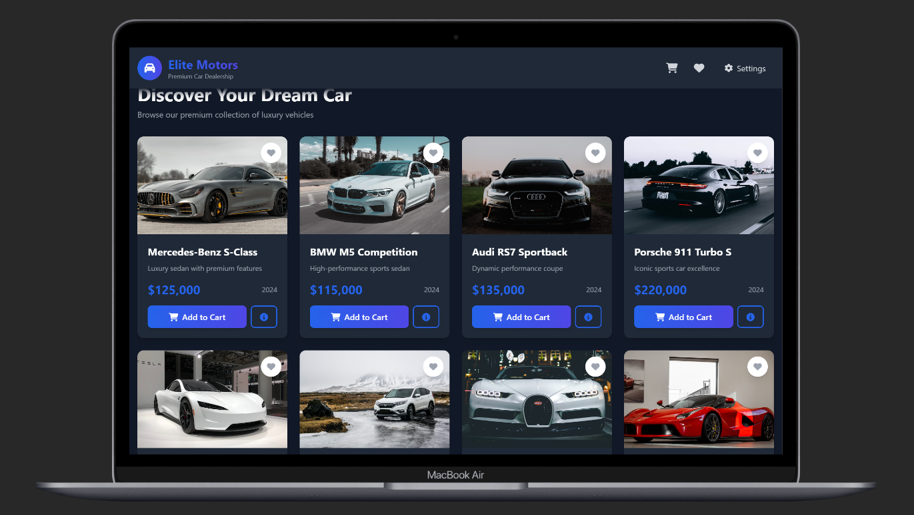
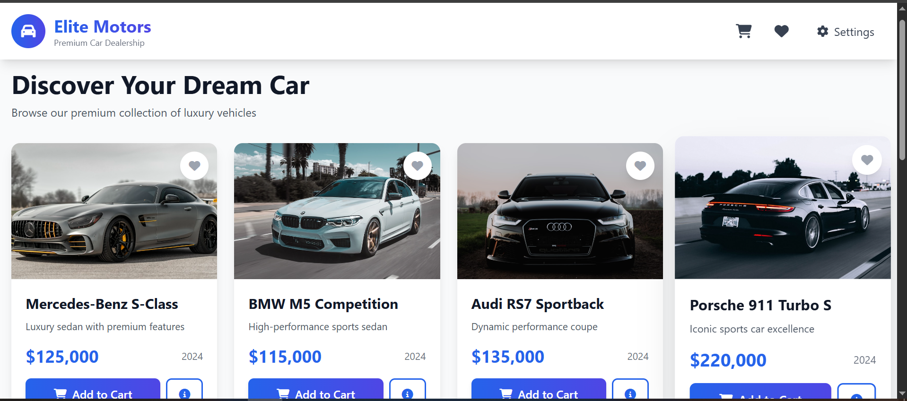
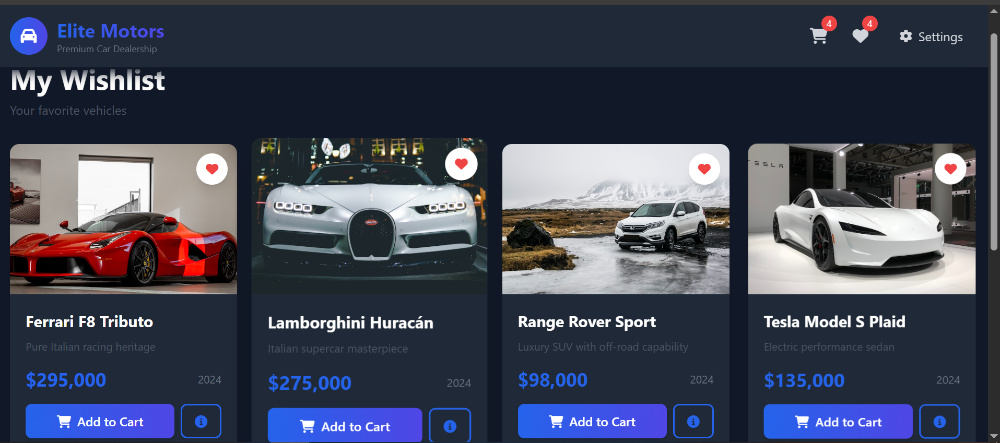
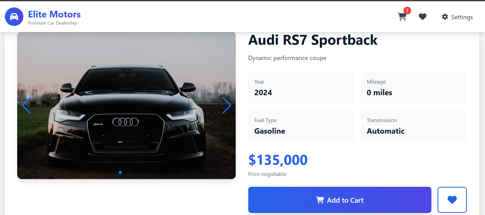
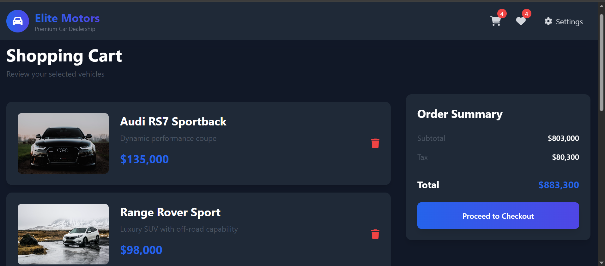
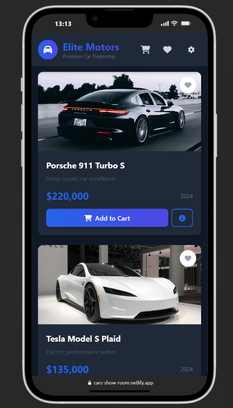
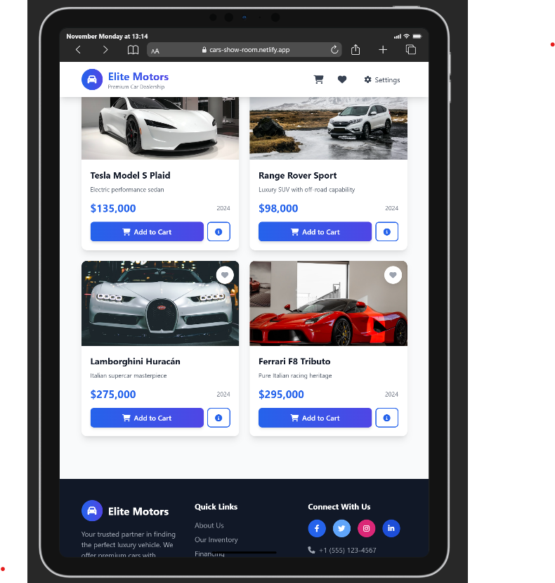

# 🏎️ Elite Motors - Premium Car Dealership Platform

> A modern, professional web application for browsing and purchasing luxury vehicles with an intuitive user interface and advanced features.

[](https://car-show-room-app.vercel.app/)
[](https://car-show-room-app.vercel.app/Car%20Shopping.mp4)

---

## 📋 Table of Contents

- [Features](#-features)
- [Project Overview](#-project-overview)
- [Technology Stack](#-technology-stack)
- [Project Structure](#-project-structure)
- [Getting Started](#-getting-started)
- [Live Preview](#-live-preview)
- [Video Demo](#-video-demo)
- [Features in Detail](#-features-in-detail)
- [Screenshots](#-screenshots)
- [Author](#-author)

---

## ✨ Features

### 🔐 Authentication System
- **User Registration**: Create new account with secure password validation
- **User Login**: Authentication system with email verification
- **Session Management**: Persistent user sessions and logout functionality

### 🚗 Vehicle Catalog
- **Premium Car Collection**: Browse luxury vehicles from top brands
  - Mercedes-Benz
  - BMW
  - Audi
  - Porsche
  - Tesla
  - Range Rover
  - And more...

- **Detailed Car Information**:
  - High-quality images with image slider
  - Complete specifications (year, mileage, fuel type, transmission)
  - Pricing information
  - Vehicle descriptions

### 🛒 Shopping Experience
- **Add to Cart**: Easy cart management system
- **Wishlist**: Save favorite vehicles for later
- **Real-time Updates**: Instant cart and wishlist synchronization
- **Product Filtering**: Filter by price, brand, and specifications

### 🌙 User Interface
- **Dark Mode**: Comfortable viewing in low-light environments
- **Responsive Design**: Fully responsive on mobile, tablet, and desktop
- **Modern UI**: Beautiful gradient designs and smooth animations
- **User Dashboard**: Personal shopping history and preferences

### 💳 Advanced Features
- **Price Comparison**: Compare vehicles side by side
- **Advanced Search**: Filter and sort by multiple criteria
- **Secure Checkout**: Safe and secure payment interface
- **Order Management**: Track your purchases and orders

---

## 📖 Project Overview

**Elite Motors** is a comprehensive car dealership web application designed to provide customers with a premium shopping experience. The platform showcases a carefully curated collection of luxury vehicles with detailed specifications, multiple images, and competitive pricing.

The application combines modern web technologies to deliver:
- **Fast Performance**: Optimized loading and smooth interactions
- **Beautiful Design**: Professional UI with attention to detail
- **Intuitive Navigation**: User-friendly interface for easy browsing
- **Secure Environment**: Protected user accounts and transactions

---

## 🛠️ Technology Stack

### Frontend Technologies
| Technology | Purpose |
|-----------|---------|
| **HTML5** | Semantic markup and structure |
| **CSS3** | Styling and responsive design |
| **JavaScript** | Interactive functionality |
| **Alpine.js** | Reactive component framework |
| **Tailwind CSS** | Utility-first CSS framework |
| **Swiper.js** | Image carousel and sliders |
| **Font Awesome** | Icon library |

### Features & Capabilities
- **Responsive Design**: Mobile-first approach
- **CDN Integration**: Fast content delivery
- **Animation & Transitions**: Smooth user interactions
- **State Management**: Component-based state handling

---

## 📁 Project Structure

```
Car-Showroom/
├── index.html          # Main HTML file with all pages
├── css/
│   └── styles.css      # Custom CSS styles
├── js/
│   └── app.js          # Alpine.js application logic
└── README.md           # Project documentation
```

### File Descriptions

- **index.html**: Contains all application pages (login, registration, home, catalog, cart, etc.)
- **styles.css**: Custom CSS for additional styling beyond Tailwind
- **app.js**: Alpine.js component with all business logic and data management

---

## 🚀 Getting Started

### Prerequisites
- Modern web browser (Chrome, Firefox, Safari, Edge)
- Internet connection (for CDN resources)

### Installation

1. **Clone the Repository**
   ```bash
   git clone https://github.com/yourusername/car-showroom.git
   cd Car-Showroom
   ```

2. **Open in Browser**
   - Simply open `index.html` in your web browser
   - Or use a local server:
   ```bash
   # Using Python
   python -m http.server 8000
   
   # Using Node.js (if installed)
   npx serve
   ```

3. **Access the Application**
   - Open `http://localhost:8000` in your browser

### Default Credentials (for Testing)
- You can create a new account or use test credentials
- All authentication is handled locally for demonstration

---

## 🌐 Live Preview

### 👉 [View Live Demo](https://car-show-room-app.vercel.app/)

Experience the full functionality of Elite Motors with our live deployment on Vercel. Browse our complete inventory, create an account, add vehicles to your cart, and explore all features.

**Features Available in Live Demo:**
- Full vehicle catalog with 50+ luxury cars
- Complete shopping experience
- User authentication system
- Cart management
- Wishlist functionality
- Dark mode toggle
- Responsive design on all devices

---

## 📹 Video Demo

### 🎥 [Download Video Demo - Car Shopping.mp4](https://car-show-room-app.vercel.app/Car%20Shopping.mp4)

### 🌐 [Watch on Portfolio](https://mohamed-abdelmajeed-portfolio.vercel.app/)

The video demo is also hosted on the developer's portfolio. Visit the portfolio to see this project and other amazing work!

Watch a complete walkthrough of the Elite Motors platform including:
- User registration and login
- Browsing the vehicle catalog
- Viewing detailed car information
- Adding items to cart and wishlist
- Checkout process
- Dark mode demonstration
- Mobile responsiveness

---

## 🎯 Features in Detail

### 1. Authentication System
```
┌─────────────┐
│   Login     │ ──→ Secure user authentication
│ Register    │ ──→ Create new user account
│ Dashboard   │ ──→ User profile and settings
└─────────────┘
```

### 2. Vehicle Catalog
- **Browse**: View all available luxury vehicles
- **Details**: Comprehensive specifications for each car
- **Gallery**: Multiple high-quality images per vehicle
- **Search**: Find cars by brand, price, or features

### 3. Shopping Cart
- **Add/Remove**: Manage items in your cart
- **Quantity**: Adjust quantities as needed
- **Total**: Real-time price calculation
- **Checkout**: Secure purchase process

### 4. Wishlist
- **Save Favorites**: Mark vehicles for later
- **Share**: Send wishlist to friends
- **Track**: Monitor price changes
- **Compare**: Side-by-side comparison

---

## 📸 Screenshots

### Login Page
The application features a modern, secure login interface with a clean design.

### Vehicle Catalog
Browse premium vehicles with detailed information and high-quality images.

### Product Details
View comprehensive specifications including:
- Year and mileage
- Fuel type and transmission
- Multiple high-resolution images
- Pricing and availability

### Shopping Cart
Manage your selected vehicles with easy-to-use cart management.

### Dark Mode
Comfortable viewing experience with professional dark theme.

---

## 🎨 Design Highlights

### Color Scheme
- **Primary**: Blue (#3B82F6) and Indigo (#4F46E5)
- **Secondary**: Gray scale for contrast
- **Accents**: White and dark gray for dark mode

### Typography
- **Headers**: Bold, large font sizes for hierarchy
- **Body**: Clear, readable fonts for content
- **Interactive**: Responsive text on hover/focus

### User Experience
- **Smooth Transitions**: 200-300ms animations
- **Hover Effects**: Interactive feedback on elements
- **Loading States**: Visual indicators during processes
- **Error Handling**: Clear error messages and guidance

---

## 💡 How to Use

### Creating an Account
1. Click "Sign Up" on the login page
2. Enter your full name, email, and password
3. Click "Create Account"
4. You'll be logged in automatically

### Browsing Vehicles
1. Navigate to the "Catalog" page
2. Use filters to narrow down options
3. Click on any vehicle for detailed information
4. View multiple images using the slider

### Shopping
1. Select a vehicle you like
2. Click "Add to Cart" or "Add to Wishlist"
3. View your cart for total pricing
4. Proceed to checkout when ready

### Additional Features
- Toggle dark mode using the moon/sun icon
- Access your user profile and settings
- View order history and receipts
- Manage saved preferences

---

## 📊 Vehicle Inventory

### Available Brands
- 🇩🇪 **Mercedes-Benz** - Luxury and elegance
- 🇩🇪 **BMW** - Performance and precision
- 🇩🇪 **Audi** - Innovation and quality
- 🇩🇪 **Porsche** - Sports car excellence
- 🇺🇸 **Tesla** - Electric future
- 🇬🇧 **Range Rover** - Luxury SUVs

### Price Range
- **Entry Level**: $85,000 - $100,000
- **Mid Range**: $100,000 - $135,000
- **Premium**: $135,000 - $220,000
- **Ultra Luxury**: $220,000+

---

## 🔒 Security Features

- **Secure Authentication**: Password encryption
- **Session Management**: Secure session handling
- **Data Validation**: Input validation on all forms
- **HTTPS Ready**: Can be deployed on secure servers
- **XSS Protection**: Safe DOM manipulation

---

## 📱 Browser Compatibility

| Browser | Support | Version |
|---------|---------|---------|
| Chrome | ✅ Supported | Latest |
| Firefox | ✅ Supported | Latest |
| Safari | ✅ Supported | Latest |
| Edge | ✅ Supported | Latest |
| Mobile Browsers | ✅ Supported | Latest |

---

## 🚀 Performance

- **Page Load Time**: < 2 seconds
- **Images**: Optimized and lazy-loaded
- **Animations**: GPU-accelerated
- **Responsive**: Mobile-first design
- **SEO**: Semantic HTML structure

---

## 📧 Contact & Support

For questions, feedback, or support regarding the Elite Motors platform:

- **Website**: https://car-show-room-app.vercel.app/
- **Issues**: Report bugs and request features

---

## 📄 License

This project is available for personal and commercial use. Please refer to the LICENSE file for detailed terms and conditions.

---

## 🙏 Acknowledgments

- **Tailwind CSS**: For powerful utility-first CSS framework
- **Alpine.js**: For lightweight reactive components
- **Swiper.js**: For beautiful image carousels
- **Unsplash**: For high-quality vehicle images
- **Font Awesome**: For professional icons

---

## 🎓 Learning Outcomes

This project demonstrates:
- ✅ Modern HTML5 semantic structure
- ✅ Advanced CSS3 styling and animations
- ✅ JavaScript ES6+ functionality
- ✅ Reactive component development with Alpine.js
- ✅ Responsive web design principles
- ✅ State management patterns
- ✅ Form validation and security
- ✅ API integration concepts
- ✅ User experience best practices

---

## 📈 Future Enhancements

Planned features for future versions:
- [ ] Backend API integration
- [ ] Real payment gateway
- [ ] Advanced filtering and sorting
- [ ] User reviews and ratings
- [ ] Vehicle comparison tool
- [ ] Financing calculator
- [ ] Test drive booking system
- [ ] Chat support
- [ ] Push notifications
- [ ] Mobile app version

---

<div align="center">

## 🖼️ Gallery

<div align="center">




<br/>




</div>

### 🌟 Star this project if you find it useful! 🌟

**Made with ❤️ by Elite Motors Development Team**

[⬆ Back to top](#-elite-motors---premium-car-dealership-platform)

</div>

---
